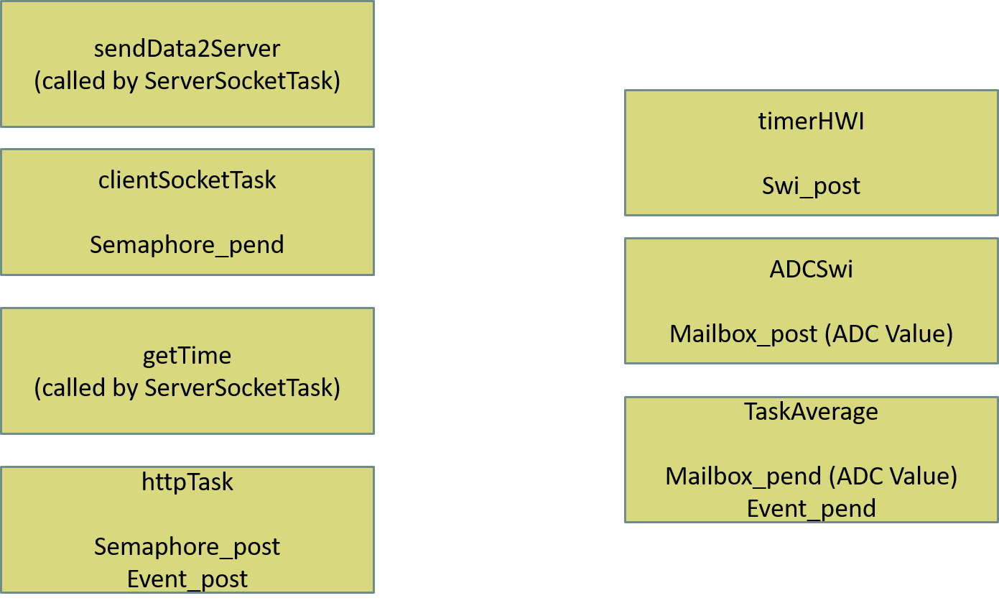

# eem449FinalProject
Rain Detector based on Rain Sensor &amp; Weatherbit API
This repository includes real-time rain detector by using rain sensor and controlled by the weatherbit API. It is implemented on Texas Intruments Tiva C Series TM4C1294 Connected Launcpad in C language within the Eskişehir Technical University and EEM449 Embedded System Design Course

##What we will do
1. Read analog rain sensor value over the GPIO pin
2. Connect weatherbit API, reach the status of current weather in JSON format
3. If both states the weather is rainy, get time current time from NTP server and send message to the TCP server

## Requirements
1. Code Composer Studio (recommended version 10.0<)
2. EK-TM4C1294XL Launcpad - TI-RTOS for Tiva C
1. Rain Sensor and at least 3 jumper cable
1. Weatherbir API Key (it is free up to 1000 cal per a day)
1. Hercules (Make TCP Server)
1. Ethernet cable to connect internet 

## Demo and Video
For Sensor usage -> [My Drive Link](https://drive.google.com/file/d/1y2vRh_AvzKrF7cOgIhf9b8NvS599G6lr/view?usp=sharing).
For Demo of the project -> [My Drive Link](https://drive.google.com/file/d/15sel_Y6Z5ZUKQOO5Tl_mMV7Vu3pUtXId/view?usp=sharing).

##

## General view of Coding

## Necessary Connections
-----------------------------
| Rain Sensor   |  Launcpad   |
|-------------|-------------  |
|   Vcc       |  5V           |
|   GND       |  GND          |
|   A0        |  PE3          |
|   D0        |  -            |
-----------------------------
